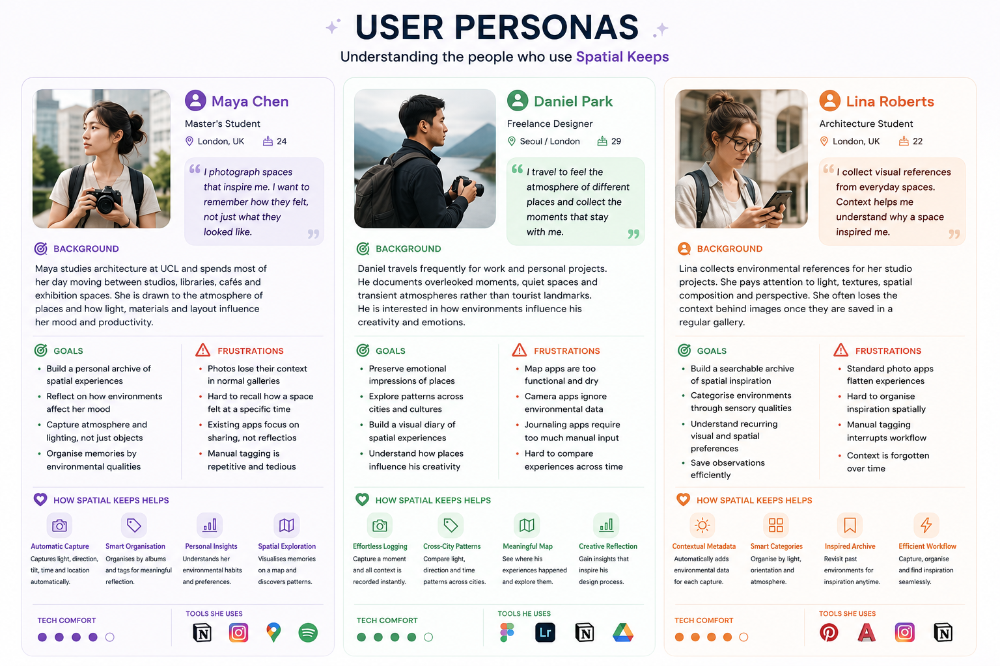
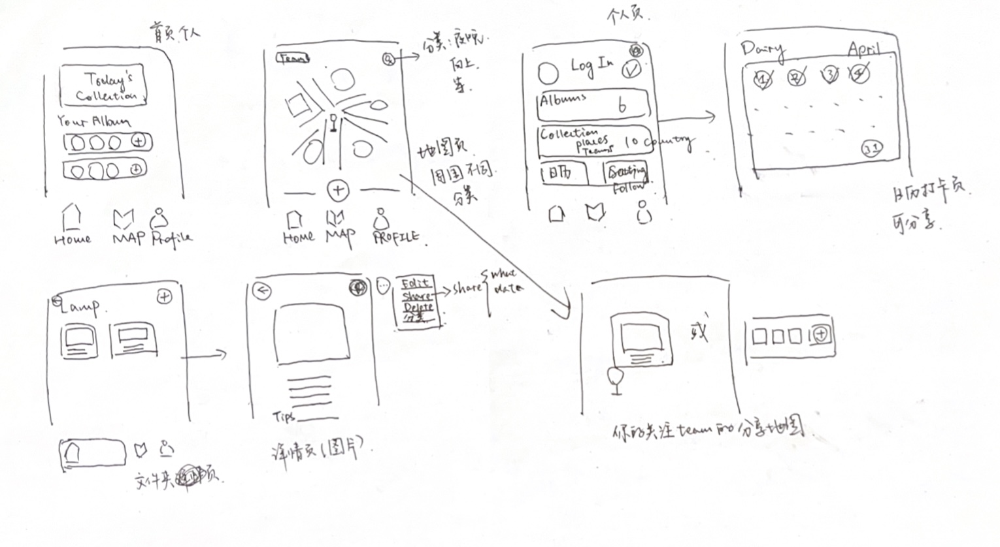
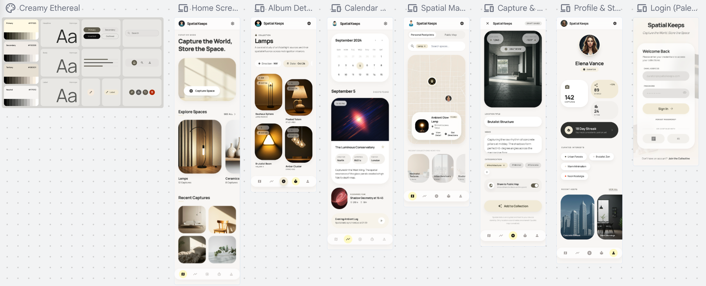
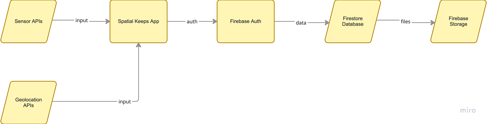

# Spatial Keeps 💫

### A reflective mobile application for capturing environmental memories through spatial and contextual sensing.

Spatial Keeps transforms everyday photo collection into a spatial memory archive by combining photography with environmental sensing, location awareness, and contextual metadata.

<p align="center">
  
</p>

<p align="center">
Built with Flutter · Firebase · Geolocation · Sensor APIs
</p>

---

# Download APK

<p align="center">

<a href="https://github.com/Lizzim24/CASA0015-Spatial_Keeps/releases">
  
</a>

</p>

The latest Android release build can be downloaded directly from the GitHub Releases page.

---

# Project Overview

Spatial Keeps is a mobile application designed to explore how environmental context shapes personal memory and spatial experience.

Unlike traditional photo gallery applications that primarily store visual content, Spatial Keeps captures additional layers of contextual information including light conditions, viewing orientation, tilt direction, timestamp, and geographic location. These environmental signals are transformed into reflective spatial metadata that helps users understand not only *what* was captured, but also *how* the surrounding environment influenced the moment.

The project was developed within the context of Connected Environments research, investigating how mobile sensing technologies can support more meaningful and context-aware digital experiences. By combining smartphone sensors with reflective archiving, the application encourages users to engage more consciously with the spaces they inhabit.

Spatial Keeps positions the smartphone not simply as a camera, but as an environmental sensing device capable of recording spatial atmosphere and behavioural patterns over time.

---


# Why Spatial Memory?

Most digital photo galleries preserve visual content but lose the environmental conditions surrounding the moment itself.

However, memory is rarely shaped by imagery alone. The atmosphere of a space — lighting conditions, movement, orientation, time of day, and surrounding context — all contribute to how places are experienced and remembered.

Spatial Keeps explores the idea that mobile devices can act as lightweight environmental sensing tools capable of recording these invisible layers of spatial experience.

By combining photography with contextual sensing, the application attempts to create a more reflective form of digital memory:

- How does lighting influence emotional perception?
- Do users repeatedly capture spaces from similar orientations?
- Are there recurring environmental patterns across everyday routines?
- Can spatial behaviour become part of personal storytelling?

Rather than functioning purely as a storage platform, Spatial Keeps acts as a reflective spatial diary that encourages users to observe how they interact with environments over time.

---


# Key Features

| Feature | Description |
|---|---|
| Spatial Capture | Capture photos together with environmental and contextual metadata |
| Environmental Sensing | Record light level, orientation, tilt, timestamp, and location |
| Spatial Archive | Organise captured experiences into reflective spatial collections |
| Public Exploration | Share selected captures through public spatial visibility |
| Spatial Insights | Discover recurring environmental and behavioural patterns |
| Firebase Integration | Cloud-based authentication, storage, and synchronisation |

---

# User Personas

Spatial Keeps was designed around users who experience environments not only visually, but emotionally and spatially.

The application particularly supports reflective users interested in documenting atmosphere, movement, memory, and environmental experience.

<p align="center">
  
</p>

Example user groups include:

- Urban explorers documenting changing city environments
- Architecture and design students studying spatial atmosphere
- Travellers preserving environmental memories beyond photography
- Reflective journal users interested in emotional and spatial patterns
- Creative practitioners exploring connected environments and digital memory

---


# Design Process

The design process focused on balancing environmental data visibility with calm and reflective interaction design.

Early iterations explored:

- metadata-heavy interfaces
- timeline-based browsing
- environmental tagging systems
- spatial storytelling layouts

The final design prioritised:
- readability
- minimal visual noise
- reflective interaction
- mobile-first usability

<p align="center">
  
</p>
<p align="center">
  
</p>

---


# System Architecture

The application follows a lightweight cloud-connected architecture combining local sensing with Firebase backend services.

Environmental data is collected directly from smartphone sensors and synchronised with Firebase services for storage, authentication, and retrieval.

<p align="center">
  
</p>

---


## Architecture Overview

The application uses a cloud-connected mobile architecture consisting of:

- Flutter front-end interface
- Firebase Authentication
- Cloud Firestore database
- Firebase Storage
- Device sensor APIs
- Geolocation services
- Google Maps integration

Environmental metadata is captured locally on-device before being synchronised to Firebase cloud services.

---


# Technical Stack

| Technology | Purpose |
|---|---|
| Flutter | Cross-platform mobile development |
| Firebase Authentication | User authentication |
| Cloud Firestore | Metadata storage |
| Firebase Storage | Image storage |
| Geolocator | GPS location tracking |
| Sensors Plus | Device sensor access |
| CompassX | Direction and orientation sensing |
| Image Picker | Camera and gallery access |
| Dart | Application logic |
| GitHub Actions | CI/CD and release builds |

---

# Application Screens

---

## Home Screen

<p align="center">
  <!-- HOME SCREEN -->
  
</p>

The home screen provides quick access to:
- capture space
- your albums
- recent activity
- navigation shortcuts

---

## Public Map

<p align="center">
  <!-- MAP SCREEN -->
  
</p>

The map view visualises personal and publicly shared captures spatially, enabling different tags exploration.

---


## Capture Screen

<p align="center">
  <!-- CAPTURE SCREEN -->
  
</p>

The capture workflow records:
- image data
- light conditions
- orientation
- timestamp
- geolocation
- contextual metadata

---

## Spatial Archive

<p align="center">
  <!-- ARCHIVE SCREEN -->
  
</p>

The Spatial Archive is the core reflective interface of *Spatial Keeps*, designed to organise captured memories through environmental and contextual relationships rather than simple chronological storage.

The archive is divided into three interconnected views:

### Archive View
A calendar-based timeline displaying when spatial memories were captured. Each entry visualises environmental moments across time, encouraging users to revisit experiences as part of an evolving spatial diary.

### Spatial View
A curated environmental summary interface presenting captured moments through contextual tags such as:
- lighting condition
- directional orientation
- device tilt and perspective
- environmental atmosphere

This creates a lightweight spatial narrative beyond traditional image galleries.

### Insights View
An analytical layer that transforms collected sensor metadata into reflective environmental summaries. The system identifies recurring spatial tendencies including:
- dominant environmental conditions
- common behavioural viewing patterns
- active time periods
- frequently visited locations

Together, these views reposition personal photography as a form of environmental memory and spatial reflection rather than passive media storage.

---

## Spatial Profile

<p align="center">
  <!-- Profile SCREEN -->
  
</p>

The Profile Page acts as a reflective summary space within *Spatial Keeps*, presenting how the user’s environmental memories accumulate over time with all the setting functions.

---


# Environmental Metadata

Spatial Archive captures contextual environmental information including:

| Metadata | Purpose |
|---|---|
| Light Level | Environmental brightness classification |
| Direction | Device orientation and spatial facing |
| Tilt | Viewing perspective |
| Timestamp | Temporal context |
| GPS Coordinates | Spatial location |
| Tags | User-defined categorisation |

The project investigates how these contextual layers can enrich digital memory systems.

---

# Challenges and Reflection

Several technical and design challenges emerged during development.

## Sensor Reliability

Environmental sensor data can vary significantly depending on:
- indoor environments
- device hardware
- user movement
- lighting conditions

This required the implementation of fallback classification systems and contextual interpretation.


## GPS Accuracy

Indoor positioning produced inconsistent results in some environments, requiring spatial approximation and fallback location handling.


## Firebase Structure Redesign

The application architecture evolved during development:
- archive structures were redesigned
- metadata handling was improved
- public/private separation was introduced

This significantly improved scalability and organisation.

## Balancing Reflection and Functionality

One major challenge involved balancing:
- reflective environmental storytelling
- practical mobile usability

The interface was intentionally designed to remain lightweight while still presenting contextual information meaningfully.

---

# Future Improvements

Future development of Spatial Keeps could significantly expand both the intelligence and interpretive depth of the application.

One important improvement would be the introduction of adaptive analysis models or lightweight machine learning techniques to better understand user behaviour and environmental context. Instead of relying on fixed thresholds, the system could learn from historical patterns and generate more personalised spatial insights.

The application could also integrate semantic scene recognition using computer vision APIs to classify environments such as cafés, libraries, streets, parks, or indoor social spaces. This would create richer environmental narratives and reduce the number of “Unknown” classifications currently present in the prototype.

Another future direction involves emotional and reflective journaling features. Users could annotate memories with moods, thoughts, or personal reflections, allowing the app to connect environmental sensing with subjective human experience.

Spatial visualisation could also be expanded through interactive maps, temporal heatmaps, and environmental timelines that reveal how user behaviour changes across locations and time periods.

From a Connected Environments perspective, the project could evolve beyond an individual archive into a shared environmental memory platform where multiple users contribute contextual observations to collaboratively document urban experiences.

Finally, future versions could improve accessibility, offline functionality, cross-platform consistency, and privacy controls, creating a more robust and deployable mobile experience.

---


# Installation Guide

## Clone Repository

```bash[
git clone https://github.com/Lizzim24/CASA0015-Spatial_Keeps.git

# Installation Guide

## Requirements

Before running the application, ensure the following tools are installed:

- Flutter SDK (3.x recommended)
- Dart SDK
- Android Studio or VS Code
- Xcode (for iOS development on macOS)
- Firebase CLI
- Git

---

## Clone the Repository

```bash
git clone https://github.com/Lizzim24/CASA0015-Spatial_Keeps.git
cd mycollection
```

---

## Install Dependencies

Run the following command to install all required Flutter packages:

```bash
flutter pub get
```

---

## Firebase Configuration

This project uses Firebase services including:

- Firebase Authentication
- Cloud Firestore
- Firebase Storage

For security reasons, Firebase configuration files are excluded from the public repository.

You will need to:

1. Create your own Firebase project
2. Enable Authentication, Firestore, and Storage
3. Add the following configuration files:

### Android

Place:

```text
android/app/google-services.json
```

### iOS

Place:

```text
ios/Runner/GoogleService-Info.plist
```

---

## Run the Application

### Android

```bash
flutter run
```

### iOS

```bash
cd ios
pod install
cd ..
flutter run
```

---

## Build Release APK

To generate an Android release build:

```bash
flutter build apk --release
```

The generated APK can be found at:

```text
build/app/outputs/flutter-apk/app-release.apk
```

---

## Build iOS Release

```bash
flutter build ios --release
```

Xcode signing configuration may be required before deployment to a physical iOS device.

---

# Project Structure

```text
lib/
 ├── models/
 ├── screens/
 ├── services/
 ├── firebase_option.dart
 └── main.dart
```

---

# Known Limitations

Although Spatial Keeps successfully demonstrates the integration of environmental sensing into a reflective mobile archive, several limitations remain in the current prototype.

The largest limitation is the analytical component of the application. While the system collects contextual data such as light intensity, orientation, tilt, timestamp and location, the interpretation layer is still relatively simplistic. Many of the generated “insights” rely on threshold-based categorisation and predefined labels rather than adaptive or intelligent analysis. As a result, some environmental interpretations may appear repetitive, overly generalised, or return placeholder states such as “Unknown Light” or “Unknown Direction” when sensor confidence is insufficient.

In addition, the current analysis system does not yet fully understand behavioural patterns or emotional context. The app identifies recurring environmental characteristics, but it cannot meaningfully interpret why a user captures certain spaces, how memories evolve over time, or how environmental conditions influence personal experience. This limits the depth of reflection that the application aims to support.

Another limitation involves sensor reliability across devices. Mobile hardware differs significantly between iOS devices, particularly in terms of available sensor APIs, compass calibration accuracy, and light sensor behaviour. Some devices may provide incomplete environmental data, reducing consistency across users.

The project also relies heavily on manual metadata interpretation rather than machine learning or semantic scene understanding. For example, the app cannot currently distinguish between meaningful spatial situations such as study environments, social gatherings, transit spaces, or emotionally significant locations.

From a technical perspective, Firebase integration introduces dependency on cloud services and internet connectivity for storage and synchronisation. Offline functionality is currently limited, and large image uploads may affect performance on slower networks.

Finally, the current user interface prioritises simplicity and aesthetic consistency, but several interaction flows could be improved. Navigation between archive views, environmental summaries, and insight pages could become more dynamic and personalised in future iterations.

# Privacy & Data

Spatial Archive stores:
- user-uploaded images
- environmental metadata
- location information

Authentication and storage are managed securely through Firebase services.

No third-party analytics or advertising systems are included.

---

# Demo Video

<!-- INSERT DEMO GIF OR VIDEO -->

<p align="center">
  
</p>

---

## Contact

Created by **Lizi Wang**  

MSc Connected Environments — UCL CASA0015

For questions, feedback, or collaboration opportunities, feel free to get in touch through me.
